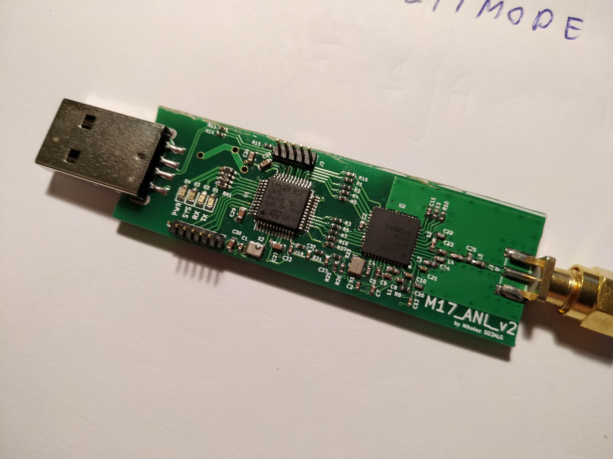
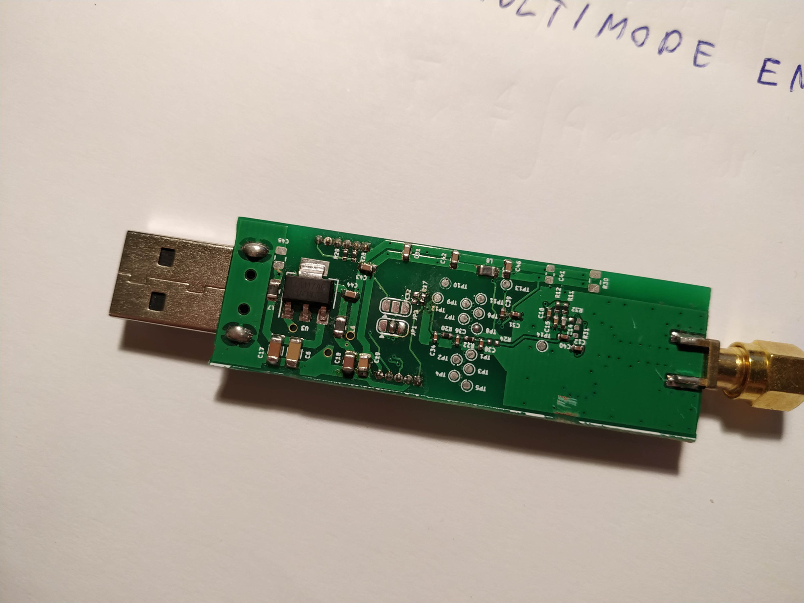

# M17_ANL_v2
New M17 hotspot/analyser, this time with ADF7021

## Photos

## Schematic
Diagram was not tested yet.
However, schematic and PCB layout is still work in progress.
First prototyped manufactured - firmware writing is still in progress.

## Technical details

M17_ANL_v2 is a radio modem designed especially to support interaction with existing M17 capable radio terminals & repeaters. It also means packet acquisition, for debugging cases or sniffing, just for fun idk.
However M17_ANL_v2 can be used to receive and transmit raw digital data - it's by design protocol agnostic. 

### Parameters

* Operating freqency range is 420MHz to 450MHz (M17 operates within amateur frequency band 430-440MHz) - after a few changes of RF elements values also another frequency bands
* Modulation schemes selectable - 2FSK, 3FSK, 4FSK, MSK and FM (for M17 - 4FSK)
* Output power level is set from -16dbm up to 10dbm (in 0.3125 dB steps)
* Data rate is set from 0.05 up to 25 kbps (for M17 - 9600 bps)
* IF filter bandwidth selectable - 12.5 kHz, 18.75 kHz, or 25 kHz
* Configuration, transmit and receive by AT commands - over USB-CDC
* All registers of ADF7021 also configurable by manual mode
* Additional 4 GPIOs - first pair can be used as I2C interface, second can be UART
* Four different colour LEDs - PWR, SYS, RX and TX - indicate the state of the device
* Programmable by SWD interface

MORE TODO

### Most important ICs used in project

* STM32F303CBT6 - MCU which controls data flow(PC <-> RF TRX), and radio parameters.
* ADF7021 - radio transceiver.

### Testpoints description

| TestPoint NO  | Description | Pin of STM32 | Pin of ADF7021 |
| ------------- | ------------- | ------------- | ------------- |
| TP1  | SPI_SCK  | PB13  | 28 |
| TP2  | SPI_MISO  | PB14  | 27 |
| TP3  | SPI_MOSI  | PB15  | 26 |
| TP4  | SPI_ENABLE  | PA8  | 25 |
| TP5  | RF_ENABLE  | PA9  | 24 |
| TP6  | DClk  | PA6  | 35 |
| TP7  | Data  | PA7  | 34 |
| TP8  | SWD  | PB0  | 33 |
| TP9  | RF_CLK  | PA5  | 36 |
| TP10  | AD  | PA2  | from Filter 1 |
| TP11  | MO  | PA3  | 37 |
| TP12  | DA  | PA4  | to Filter 2 |
| TP13  | FMDM  | to Filter 1  | 33 |
| TP14  | FMM  | from Filter 2  | 21 |

Filter 1 - used by ADC,
Filter 2 - used by DAC

MORE TODO

### Headers description

| Header  | Pin | Pin of STM32 | Use case |
| ------------- | ------------- | ------------- | ------------- |
| J4  | 1  | GND  | X |
| J4  | 2  | PB9  | GPIO, I2C_SDA |
| J4  | 3  | PB8  | GPIO, I2C_SCK |
| J4  | 4  | PB7  | GPIO, USART_RX |
| J4  | 5  | PB6  | GPIO, USART_TX |
| J4  | 6  | VCC  | X |
| ------------- | ------------- | ------------- | ------------- |
| J3  | 1  | NRST  | RST |
| J3  | 2  | GND  | X |
| J3  | 3  | PA13  | SWDIO |
| J3  | 4  | PA14  | SWCLK |
| J3  | 5  | VCC  | X |

## Control software

TODO
